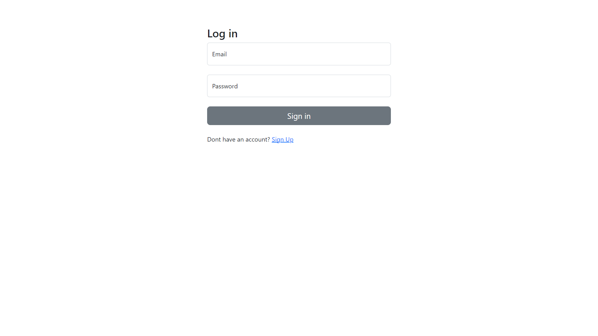

# OOP / Booking App

This is a basic representation of a booking system. The application shows the user a list of hotels they can stay in and allow them to make bookings too.

Users  have the ability to perfom CRUD operations on their profiles as well as cancel previous bookings if they are more than 2 days away.

## 1. Login & Registration

Upon open the aplication url you will be greated by the Login section.

### 1.1 Login 

- If you already have an account just fill in your details and you will be redirected to the dashboard.

### 1.2 Registration
- If you do not have an account click on where it says [Sign up](/register.php). the link will take you to the registration page.

- If your registration is successful, you will be taken to the dashboard.

## 2. Dashboard

- From your dashboard you can select which hotel you want to stay at from the list. The book now button on each hotel will take you to the book now page where you can select your dates.

- Once you have made a booking all your previous booking information will be shown on the left or bottom(if using mobile) of the screen. Yo can cancel any trip thats nore than 2 days away from check in.

## 3. Book Now page

- You can arrive to this page by clicking one of the hotels or clicking the link in the top nav. 
    - The top nav link will have the first hotel in the list selected but you can still select other hotels from the list.
    - By clicking the book now button the hotel will alredy be selected but you can also still pick a different hotel of your choice.

## 4. Confirm page

- This page will show you all features and costs of your hotel choice. You can also compare agains other hotels and you'll get information based on how many days you picked to stay.

- You can then decide to continue with your original choice or pick another hotel based on the  information you see.

- After you confirm you will be taken back to the Dashboard.

## 5. Profile page

- The profile page allows you to change your name & surname. you cannot  change your email because it is also your userID 

- ### 6 Logout
- When you are done. Click the log out button and you will be back to the login page.

***
